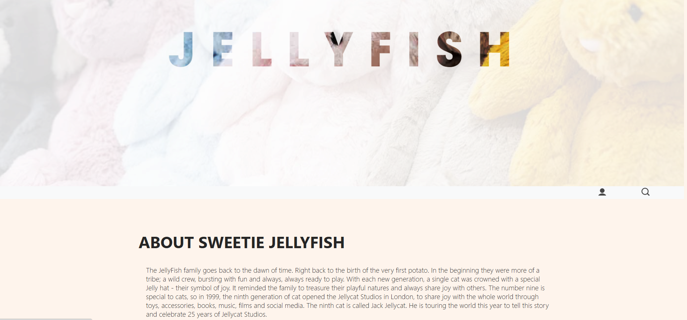

# 🛒 RabitShop - Online Shopping Cart System

RabitShop is an online shopping web application that allows users to browse, manage, and purchase plush toys with a structured MVC architecture.

---

## 📌 Project Overview

Developed in Semester 4 as a full-stack web application.

The system supports:
- Product browsing
- Shopping cart management
- Order processing
- Admin product management

---

## 🛠 Tech Stack

- Java Servlet
- JSP
- JSTL
- Tomcat 8
- SQL Server
- MVC Design Pattern

---

## 🚀 Features

- 👤 User registration & login
- 🛍 Add/remove items from cart
- 💳 Checkout functionality
- 🗂 Product filtering & searching
- 🛠 Admin product management

---

## 🗄 Database

- SQL Server
- Relational structure with foreign keys
- Product & Order management tables

---

## 📸 Demo Screenshots

### 🏠 Home Page

  

  

---

### 🛍 Product Page

  

